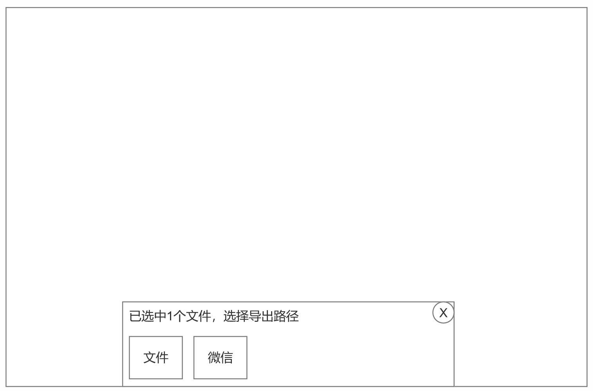

# DGCamp Paint工具

|版本号|需求简介|需求时间|负责人|
|---|---|---|---|
|v1\.0\.0|原有canvas大部分、项目管理、图层功能|2026\.07\.13|邹建宁|

## 需求简介

1. 原有的canvas框架可以迁移过来

2. 笔刷系统，从开源软件迁移过来（8月中\-8月底挪过来）

3. 项目管理页面开发

4. 图层功能添加，包括基本的图层操作、混合模式等

## 项目管理页面

1. 项目默认上次修改时间（高优）\+创建时间倒排（次优）倒排，后修改的排在前边

2. 长按单个项目2秒，会弹出操作列表

    1. 重命名，点击后会有输入框，最多支持10个中文字符长度，常驻提示

    2. 复制，点击后会生成一个命名为“作品名\-复制”的文件，在列表最前方

    3. 导出，会拉起导出列表，目前支持保存到设备本地文件夹、微信。（后续会补充其他软件/路径）

    4. 删除，点击后，会有二次确认弹窗，确定后，该文件会被删除

    5. 信息，点击后，会有该文件的信息，具体如下

#### 弹窗列表交互规则：

1. 点击弹窗外空白处，会关闭操作列表，并取消弹窗内的内容

2. 点击操作列表的任一选项，列表也会关闭

### 批量管理

点击右上角管理按钮，会进入批量管理界面，文件右下角出现选中框，界面最上方出现批量操作按钮。

1. 文件选中数量不做限制

2. 删除，选中文件后，点击删除，会有二次确认弹窗“是否删除这些文件”

3. 导出，选中文件后，点击导出，下方会弹出目标列表

4. 导入，会打开设备本地文件夹目录，定位到picture文件夹

5. 点击退出管理，会退出管理状态，取消文件选中等

自定义格式、支持psd等常规格式

### 新建项目

1. 点击新建项目，默认进入预设画布页面，用户点击其一，可以快速创建项目，进入绘画流程

2. 可以切换到自定义画布

    1. 默认选择无纸纹，用户可以切换

    2. 默认宽度和高度，是屏幕宽高，默认单位是像素px，可以切换到厘米、毫米、英寸

        1. 如果切换单位，前边的数值会随着DPI设置发生变化

        2. 修改画布像素数，最大图层数也会发生变化，具体规则需要和开发协商

    3. PPI?DPI，需要产品再研究一下

    4. 颜色配置，下拉可以选择其中之一，具体范围待确定

### 社区弹窗热点

暂时不需要考虑，会在后续版本开发

## 笔刷系统

尽快将Krita笔刷系统导入，产品、原画师进行测试

## 图层相关

暂定大致不如如上，图层位于右侧，通过左右滑动，有三种状态，上图为默认状态，左滑可以拉出详情，右滑可以收起图层区域。

1. 默认有一个背景图层，只可以勾选或者不勾选显示，不可删除，不可移动等

2. 默认有图层1，默认选中图层1，直接绘画会出现在图层1上

### 图层操作

默认状态和拉出状态，点击单个图层，均会弹出操作列表，包含如下功能

1. 重命名，重命名图层

2. 选择，

    - 作用：载入选区，选中本图层里所有画了像素的区域（空白透明部分不会选中），画布出现虚线选区；双指长按图层可快速唤起。

    - 绘画用法：选好底色图层后，上层新建图层画阴影、高光，笔触只会限定在物体轮廓内；等价 CSP 里 **Ctrl \+ 单击图层缩略图载入选择区**

3. 拷贝

    - 把当前图层像素存入 iPad 剪贴板，原图层不变；之后三指下滑画布点粘贴生成新图层；**可以跨画布甚至粘贴到微信、备忘录**Procreate。

    - 和左滑图层【复制 Duplicate】区分： 

        - 拷贝：放到剪贴板，可以跨画布；

        - 复制：只在当前画布原地复制副本，混合模式一并继承。

    - CSP 对应：选中图层内容复制到剪贴板。

4. 填充图层

    1. 选取当前选定的前景色铺满整个图层，空白区域全部填上颜色，适合快速铺底色、背景图层填充纯色。

5. 清除选区

    1. 清空当前图层里面有像素的内容，图层保留，画面变成空白透明；相当于一键清空图层画面。

6. 阿尔法锁定

    - 只作用在**当前这一个图层**，开启后你只能在已经画过颜色的区域内绘画，画面空白处画不上笔触；修改完关掉锁定即可。

    - 典型场景：给画好的底色改色、加深颜色。

    - CSP 对应：图层启用 Alpha 锁定；

    > 和剪辑蒙版区分：Alpha 锁定仅限本图层；剪辑蒙版是上层图层依托下层轮廓作画。
    > 
    > 

7. 蒙版

    在当前图层上方绑定一个蒙版缩略图，蒙版只用黑白灰绘制：

    - **黑色＝隐藏画面，白色＝显示画面，灰色＝半透明**；只是遮挡画面，原图像素不会被真正擦除，后期随时恢复画面内容，非破坏性编辑Procreate。

    - 用途：裁切画面、做虚化边缘、局部隐藏画面；蒙版和原图绑定在一起。

    - CSP 对应：图层蒙版。

8. 剪辑蒙版

    1. 新建图层放在底色图层上方，本图层开启剪辑蒙版（图层缩略图左侧出现小箭头）；上层绘画范围严格限定在下层图层有像素的区域；超出下层轮廓的内容不会显示。

    2. 优点：上层可以单独调整混合模式（Multiply、Screen、Color）、透明度；可以堆叠很多剪辑蒙版图层；底层原图完全不受破坏。

    3. 插画高频用法：阴影、高光、环境色、纹理全部做剪辑蒙版图层。

    - CSP 对应：剪贴蒙版（Clipping Mask）Procreate。

    > 三者一句话区分：
    > 
    > - Alpha 锁定：本图层内作画；
    > 
    > - 剪辑蒙版：上层图层跟着下层轮廓作画；
    > 
    > - 图层蒙版：在本图层上方用黑白灰遮挡原图。
    > 
    > 

9. 反转

    把图层里所有像素取补色：黑色变白，蓝色变黄，红色变青色；线稿图层反转可以把黑线稿变成白线稿，后期做特效使用。

    - CSP 对应：反转颜色。

10. 参考

    开启参考的图层会被软件识别为基准图层；在它上方新建图层涂色时，画笔只会画在参考图层的轮廓里面，不用开启剪辑蒙版，非常适合铺底色。 举例子：线稿图层开启参考，新建图层铺色，颜色不会画出线稿外面。

    - CSP 对应：参照图层。

11. 向下合并

    当前图层和正下方图层合并成一个图层，两个图层像素融为一体，混合模式失效，合并之后不能分开；图层数量变少，后期修改灵活性下降。

    - CSP 对应：向下合并图层。

12. 向下组合

    **只是编成图层组，像素不合并**，当前图层和下方图层打包放进一个图层文件夹，两个图层依旧独立，可以单独修改、开关可见性，后期调整自由度高。

    - CSP 对应：图层编组。

除以上交互外，

1. 支持按住单个图层，上下移动，调整图层顺序

2. 图层组功能暂不开发，等下一版本；

### 混合模式操作

点击某个图层的N图标，可以打开混合模式选择，并且有图层透明度调整功能。

### 混合模式基础定义

- 基色 A：下层图层（底色）

- 混合色 B：上面图层（你设置混合模式的图层）

- 结果色 C：软件经过数学运算后最终显示的像素颜色

> 规则：**RGB 分开逐通道计算（R、G、B 单独运算）；透明度最后参与加权**。 为计算方便，把 RGB 数值 0‑255 换算成 0‑1 区间（黑色 = 0，白色 = 1），公式会更简洁。 最终还要结合上层图层的**不透明度 Opacity \(d\)： 最终显示 = d× 运算结果 \+ \(1‑d\)× 下层颜色**。 100% 不透明度时只取混合运算结果。
> 
> 

分层顺序关键：上下调换结果会改变（只有滤色、正片叠底互换不变）

上层和下层颠倒后，叠加、柔光、颜色加深结果完全不一样。

### 图层混合模式介绍

#### 一、基础组（Normal 普通）

#### 二、变暗组（画阴影、闭塞、压暗画面，高频）

#### 三、变亮组（高光、反光、环境光，高频）

#### 四、对比组（质感、体积、纹理，插画常用）

#### 五、色彩组（上色、改色、统一色调，OC 插画核心）

#### 六、差值类（绘画基本不用，后期特效）

