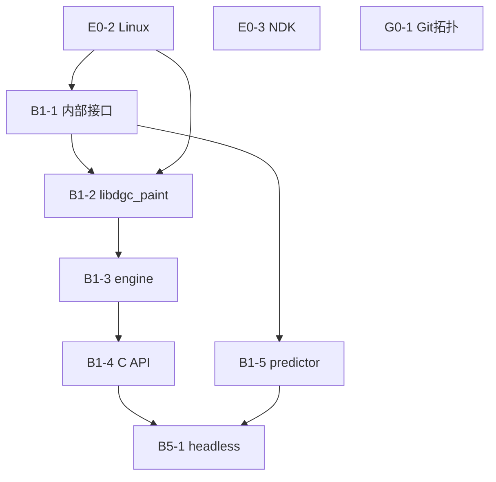

# 任务书 · A–E 共同基座（SDK：C API + 内部 core）

> **范围**：本仓库是 **dgc_paint SDK**。内部 C++（engine / 插拔接口 / Null 桩）+ 对外 **C API** + Git 消费约定。五条路线换的是 SDK **内部** `kernels/` `render/`，C API 不变。
> **状态 SOT**：[`docs/tasks/任务线.md`](../任务线.md)。
> **依据**：[`docs/调研/路线整理.md`](../../调研/路线整理.md) §一、§四、**§七**；[`docs/git/README.md`](../../git/README.md)。
> **版本**：v2.0 · 2026-08-21 · 仓库不含消费者

---

## 范围 / 非范围

### 做

| 层 | 内容 | 路径 |
|---|---|---|
| 对外 ABI | `dgcCreate` / `dgcSetSurface` / `dgcStrokeTo` / `dgcRender` / 笔刷 API 等 | `sdk_api/dgc_paint_c_api.h` |
| 内部 L0 | 类型；`IPaintKernel` / `IRenderBackend`（**不对外**） | `core/types.h` `core/interfaces/` |
| 内部 L1 | engine、ring_buffer、stroke_predictor | `core/` |
| 空跑桩 | Null 内核 / Null 渲染 | `core/` 内 |
| 骨架 | `add_library(dgc_paint)`；路线 option；`kernels/` `render/` 空占位 | 仓库根 CMake |
| Git | 远端拓扑、消费者 `sdk/` submodule 模板、bootstrap | `docs/git/` `scripts/bootstrap-consumer.sh` |
| 测试 | headless ctest 只调 C API | `tests/` |

### 明确不做（消费者仓库或后续路线任务书）

- **任何 UI**：`ui/` `app/` Compose / ImGui / Jetpack Ink / GLFW 窗口。
- **`platform/` 与 `IPlatform`**：窗口句柄由消费者传入 `dgcSetSurface`。
- **JNI**：由 `paint-android` 自备；本 SDK 只提供 C ABI。
- **真实 L4/L5**：Vulkan/Skia/bgfx、`kernels/brush` 算法、libmypaint、IGpuContext。
- 在本仓库 `gh repo create` 消费者（本环境 gh 只读；G0-1 只交文档/模板/脚本）。

---

## 任务总表

| ID | 任务线 | 任务名称 | 依赖 |
|---|---|---|---|
| G0-1 | 线G-Git | 远端拓扑 + `docs/git/` 消费者模板 + `scripts/bootstrap-consumer.sh` | — |
| B1-1 | 线1-内部 | 内部类型 + IPaintKernel/IRenderBackend + Null 桩，host 可编译 | E0-2 |
| B1-2 | 线1-骨架 | CMake 多 toolchain + 路线 option + `add_library(dgc_paint)` + 空 kernels/render | B1-1、E0-2 |
| B1-3 | 线1-引擎 | engine 三线程 + ring_buffer SPSC 单测 | B1-2 |
| B1-4 | 线1-CAPI | `sdk_api` C API 封装 engine+Null；未实现项返回错误码 | B1-3 |
| B1-5 | 线1-预测 | 内部 stroke_predictor + host 单测 | B1-1 |
| B5-1 | 线5-闭环 | headless ctest 调 C API；android-arm64 在 E0-3 满足时编出 .so | B1-4、B1-5 |

---

## 依赖关系



`android-arm64` **构建验证**在 E0-3 完成后做；B1-2 必须提交 preset 文件。B5-1 无 NDK 时 host ctest 仍须通过。G0-1 无依赖。E0-5 **不是** 任何 B 任务的依赖。

| 依赖 | 理由 |
|---|---|
| B1-1 → E0-2 | Null 桩需要 Linux 编译器。 |
| B1-2 → B1-1、E0-2 | `dgc_paint` 目标要编进内部对象。 |
| B1-3 → B1-2 | engine 是库内目标。 |
| B1-4 → B1-3 | C API 封装已存在的 engine。 |
| B1-5 → B1-1 | predictor 输入是内部 `StrokePoint`。 |
| B5-1 → B1-4、B1-5 | 闭环走公开 C API；预测在 SDK 内可测。 |

---

## G0-1 · 远端 Git 拓扑与消费者约定

**目标**：写清「本库是 SDK、消费者 submodule 引用」，并给出可复制模板。不在本任务创建 GitHub 仓库。

**产出**

- `docs/git/README.md`：拓扑（`paintDemo` / `paint-android` / `paint-pc`）。
- `docs/git/templates/paint-android/`、`docs/git/templates/paint-pc/`：README + 示例 CMake（`add_subdirectory(sdk)`）。
- `scripts/bootstrap-consumer.sh`：在**已存在的空克隆**里 `git submodule add` 本仓库到 `sdk/`。

**约定（必须写进文档）**

- submodule 路径固定 **`sdk/`** → `https://github.com/KryieNaruto/paintDemo.git`。
- 钉 **commit 或 tag**，禁止长期漂浮跟踪 `main`。
- 消费者只 `#include "dgc_paint_c_api.h"`，禁止 include `core/`。
- clone：`git clone --recurse-submodules ...`

**验收**

- 文档列出待建仓库名与用途；模板 CMake 只链 `dgc_paint`。
- 脚本 `--help` 说明「先自己 `gh repo create` / 网页建空库」。
- 本仓库根目录仍无 `ui/` `app/` 消费者代码。

**依赖理由**：无。

---

## B1-1 · 内部接口 + Null 桩

**目标**：L4/L5 内部插拔桩立住；对外仍不可见。

**产出**

```cpp
// core/types.h — StrokePoint / BrushParams / StampData
// core/interfaces/i_paint_kernel.h
// core/interfaces/i_render_backend.h
// 不提供 i_platform.h
```

- `NullPaintKernel::strokeTo` 返回空 vector。
- `NullRenderBackend` 的 init/composite/present 为空操作。
- **不**实现 dab、不创建 VkDevice。

**验收**：host 可编译 Null 桩；无 `IPlatform`；无 GLFW。

**依赖理由**：E0-2。

---

## B1-2 · CMake：产出 libdgc_paint

**目标**：一份 CMake 编 SDK 库，不是编 App。

**产出**

- 顶层 `CMakeLists.txt`：`add_library(dgc_paint ...)`；`DGCPAIN_KERNEL_{BRUSH,MYPAINT,GPU}`、`DGCPAIN_RENDER_{VULKAN,SKIA,BGFX}` 与规划合法性检查一致。
- `CMakePresets.json`：`host-linux` / `host-windows` / `android-arm64`。`host-windows` 实测归 **E0-4（VS2026）**，本任务保证 preset 文件存在。
- `kernels/` `render/` 可空占位；无实现时链 Null，**不得**填入真实 dab/compute。
- PUBLIC include **仅** `sdk_api/`（头文件可在 B1-4 才补齐；本任务至少把库目标与内部 sources 立住）。

**验收**

- `cmake --preset host-linux` 配置通过，编出 `libdgc_paint`（或静态库）。
- 不链接 GLFW/ImGui。
- `android-arm64` preset 文件存在；无 NDK 时失败信息可读。
- `host-windows` preset 文件存在；在 VS2026 上实测归 E0-4。

**依赖理由**：B1-1、E0-2。

---

## B1-3 · engine + ring_buffer

**目标**：Input → Brush → Render 三线程在 SDK 内运转；点从 C API 入队（C API 在 B1-4 接上）。

**产出**：`core/engine.*`、`core/ring_buffer.h`；ring_buffer 单测。

**验收**：ctest 覆盖满/空/环绕；engine start/stop 不卡死；不改接口为 GPU command。

**依赖理由**：B1-2。

---

## B1-4 · C API 边界

**目标**：唯一稳定 ABI。对齐路线整理 §7.3，并补错误码与预测标记。

**产出** `sdk_api/dgc_paint_c_api.h`（C 链接）至少含：

```c
DgcContext* dgcCreate(void);
void        dgcDestroy(DgcContext*);
int         dgcSetSurface(DgcContext*, void* nativeWindow, int w, int h);
int         dgcResize(DgcContext*, int w, int h);
int         dgcBeginStroke(DgcContext*, float x, float y, float pressure, float tiltX, float tiltY);
int         dgcStrokeTo(DgcContext*, float x, float y, float pressure, float tiltX, float tiltY, int isPredicted);
int         dgcEndStroke(DgcContext*);
DgcBrush    dgcCreateBrush(DgcContext*, const DgcBrushParams*);
DgcBrush    dgcLoadBrushFromMyb(DgcContext*, const char* mybJson); /* 本期可返回无效句柄+错误 */
int         dgcDestroyBrush(DgcContext*, DgcBrush);
int         dgcSetBrush(DgcContext*, DgcBrush);
int         dgcRender(DgcContext*);
int         dgcClear(DgcContext*, float r, float g, float b, float a);
const char* dgcGetLastError(void); /* 0 成功；非 0 函数失败时可读 */
```

`dgcSetSurface` 在 Null 后端可接受 `nativeWindow == NULL`（headless）。`dgcLoadBrushFromMyb` 在无 L5 时失败并 `dgcGetLastError` 说明未实现。

**验收**

- 头文件可被纯 C 编译器解析（`extern "C"`）。
- 实现链接进 `dgc_paint`；无 C++ 符号作为公开 API。
- 消费者可见头只有这一份。

**依赖理由**：B1-3。

---

## B1-5 · 内部 stroke_predictor

**目标**：预测覆盖策略在 SDK 内钉住；Android 是否送 `isPredicted` 由消费者决定。

**产出**：`core/stroke_predictor.*` + host 单测。

**验收**：给定速度外推点带预测标记；真实点覆盖关系可断言。不实现 GPU 重合成。

**依赖理由**：B1-1（可与 B1-2/3/4 并行）。

---

## B5-1 · headless C API 闭环

**目标**：不启动窗口，证明 SDK 可被链接与调用。

**产出**

- `tests/test_c_api_smoke.cpp`（或 `.c`）：create → begin/stroke(含 isPredicted)/end → render → destroy。
- 集成说明：消费者如何 `add_subdirectory(sdk)`（可链到 `docs/git/`）。

**验收**

- host `ctest` 该用例通过；无显示服务器。
- E0-3 满足时 `android-arm64` 编出 `.so`。
- grep：无 GLFW/VkInstance/真实 brush 实现；无 `ui/` `app/`。

**依赖理由**：B1-4、B1-5。

---

## 评审打「通过」的必要条件

| 任务 | 指标 |
|---|---|
| G0-1 | 拓扑文档 + 两套模板 + bootstrap；submodule 路径 `sdk/` |
| B1-1 | 内部接口 + Null 可编译；无 IPlatform |
| B1-2 | 编出 dgc_paint；三 preset 文件；不链 GLFW |
| B1-3 | ring_buffer 单测 + engine start/stop |
| B1-4 | C 头 + 错误码 + isPredicted；myb 未实现有错误 |
| B1-5 | predictor host 单测 |
| B5-1 | headless ctest 走 C API；无真实 L4/L5 |

---

## 里程碑

| 里程碑 | 触发 | 交付 |
|---|---|---|
| SDK-M1 | G0-1 + B1-2 | 消费约定 + 能编出空库 |
| SDK-M2 | B1-4 | C ABI 可被 headless 调用 |
| SDK-M3 | B5-1 | 无 UI 的 SDK 闭环，消费者可 submodule |

---

> **后续不在本仓库任务线**：`paint-android` / `paint-pc` 的窗口、输入、JNI、Compose、ImGui；路线 E 的 brush+Vulkan；A/C/D/B 专线。
