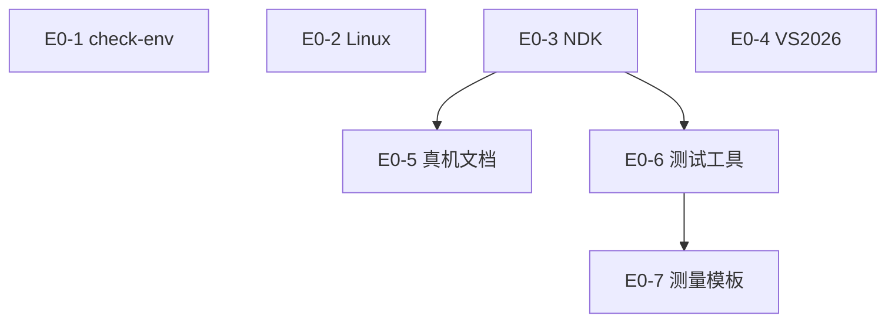

# 任务书 · 开发环境与测试环境（SDK 工具链）

> **范围**：只覆盖**编译本仓库 `libdgc_paint` SDK** 所需工具链与测量规程。不包含消费者（Compose / GLFW / ImGui / Jetpack Ink）的安装。
> **状态 SOT**：[`docs/tasks/任务线.md`](../任务线.md)（本文件不改状态列）。
> **依据**：[`DGCPaint_技术规划.md`](../../../DGCPaint_技术规划.md) §1、§3；[`docs/调研/路线整理.md`](../../调研/路线整理.md) §7。
> **版本**：v2.0 · 2026-08-21 · SDK 仓库收窄

---

## 范围 / 非范围

### 做

- 换机探测脚本：cmake / ninja / C++ 编译器；NDK、Vulkan **有则探测、无则警告**（不因缺失 GLFW/JDK 失败）。
- Linux host 依赖落地：`build-essential cmake ninja-build libvulkan-dev`。
- 命令行 NDK + Android CMake toolchain，用于编 `libdgc_paint.so`。
- Windows **VS2026** 编 `dgc_paint.dll` 的核对表（【人工】）。
- 消费者联调用真机清单（文档放本仓库，**不阻塞** SDK 构建）。
- AGI / RenderDoc / SurfaceFlinger / 高速摄影规程（指标在 SDK 的 render/kernel 内打点）。
- 规划 §3.3 性能指标测量模板（空白记录表）。

### 不做

- 不把 **GLFW / JDK / Android Studio GUI / Jetpack Compose / ImGui** 列为 SDK 必需。
- 不在本仓库创建 `ui/` `platform/` `app/` 或消费者工程。
- 不创建 SDK 的 CMake 工程本体（归基座 **B1-2**）。
- 不实现 L4/L5，不宣称 §3.3 已经测到达标。
- 不 `gh repo create` 消费者仓库（Git 拓扑归 **G0-1**）。

---

## 任务总表

| ID | 任务线 | 任务名称 | 依赖 | 人工 |
|---|---|---|---|---|
| E0-1 | 线0-开发环境 | 固化换机文档 + `scripts/check-env.sh`（cmake/ninja/C++；NDK/Vulkan 有则探测） | — | 否 |
| E0-2 | 线0-开发环境 | Linux host 工具链落地（build-essential/cmake/ninja/libvulkan-dev）并跑通探测 | — | 否 |
| E0-3 | 线0-开发环境 | 命令行 NDK + Android CMake toolchain，用于编 `.so`（Studio/Compose 标消费者侧） | — | 部分 |
| E0-4 | 线0-开发环境 | 【人工】Windows host：VS2026 C++ 桌面 + LunarG Vulkan SDK，用于 `dgc_paint.dll` | — | 是 |
| E0-5 | 线0-测试环境 | 【人工】消费者联调真机清单（adb/横屏/关降频）；不阻塞 SDK 构建 | E0-3 | 是 |
| E0-6 | 线0-测试环境 | 测试工具文档：AGI / RenderDoc / SurfaceFlinger latency / 高速摄影规程 | E0-3 | 否 |
| E0-7 | 线0-测试环境 | §3.3 性能指标测量模板（不含实测达标） | E0-6 | 否 |

`E0-1` / `E0-2` / `E0-3` / `E0-4` 无交叉依赖，可并行。

---

## 依赖关系

| 依赖 | 理由 |
|---|---|
| E0-5 → E0-3 | 真机联调文档引用 `adb`（NDK/SDK `platform-tools`）。不作为 B1/B5 的依赖。 |
| E0-6 → E0-3 | Android 抓帧/延迟工具以 NDK/调试通道约定为前提。 |
| E0-7 → E0-6 | 测量模板必须指向已写明的工具命令。 |

与基座书的跨书依赖：B1-1 / B1-2 依赖 **E0-2**；`android-arm64` 编 `.so` 在 **E0-3** 满足后验证（见 [`共同基座.md`](共同基座.md)）。

---

## E0-1 · 换机文档 + check-env

**目标**：clone SDK 后一条命令知道缺什么。缺 GLFW/JDK **不得**导致脚本失败。

**产出**

- `scripts/check-env.sh`
- README 或 `docs/env/` 中与脚本一致的版本下限。

**探测规则**

| 项 | 行为 |
|---|---|
| cmake ≥ 3.22、ninja、C++ 编译器 | 缺则非零退出 |
| ANDROID_NDK_HOME / NDK | 有则打印版本；无则警告，**默认仍 0 退出**（host 可先编） |
| Vulkan 头/`libvulkan` | 有则探测；无则警告（Null 后端不需要；L4 才硬依赖） |
| GLFW / JDK / Studio | **不探测为失败项**；可打印「消费者侧，见 docs/git/」 |

**验收**

- 仅缺 NDK 的 Linux 上脚本以 0 退出并警告 NDK。
- 缺 cmake 或 C++ 编译器时非零退出。
- 不新增工程 `CMakeLists.txt`。

**依赖理由**：无。

---

## E0-2 · Linux host 工具链

**目标**：host 能编 `libdgc_paint` 与 ctest。

**产出**

- `docs/env/linux-host.md` 或 README 段落：`build-essential cmake ninja-build libvulkan-dev`。
- 可选 `scripts/setup-linux-host.sh`（需 sudo，文档声明）。
- **不**安装 `libglfw3-dev` 作为 SDK 必需。

**验收**

- `g++`/`cmake`/`ninja` 可执行，cmake ≥ 3.22。
- Vulkan 头可发现（`pkg-config` 或 `#include <vulkan/vulkan.h>` 探测）。无 GPU 运行时不视为失败。
- 不创建 SDK CMake 工程，不编译 `core/`。

**依赖理由**：无。可与 E0-1 并行。

---

## E0-3 · 命令行 NDK（编 .so）

**目标**：不依赖 Android Studio GUI，用 NDK + `android.toolchain.cmake` 交叉编译 SDK `.so`。

**产出**

- 组件清单：NDK r27+（建议 r28）、CMake 3.22+、`ANDROID_NDK_HOME`、`android-arm64` 所需 `ANDROID_ABI=arm64-v8a`、`ANDROID_PLATFORM=android-30`。
- 明确：**Android Studio / Gradle / Compose / JDK 21 属于 `paint-android` 消费者**，本任务只点名、不安装验收。

**验收**

- 文档可照做装好命令行 NDK；探测区分已配置/未配置。
- 无 NDK 的云环境允许只交文档 + 探测警告，不强制编出 `.so`。
- 不引入 `app/` 或 Compose 工程。

**依赖理由**：无。

---

## E0-4 · 【人工】Windows 编 DLL（VS2026）

**目标**：Windows 开发者用 **VS2026** 编 `dgc_paint.dll`，不是在 Linux 云环境装 VS。版本与规划 §1.2 一致，不用 VS2022。

**产出**

- `docs/env/windows-host.md`：**VS2026**「使用 C++ 的桌面开发」+「C++ CMake tools for Windows」+ Ninja；[LunarG Vulkan SDK](https://vulkan.lunarg.com/)。
- 核对表：用 VS2026 打开仓库根目录识别 `host-windows` preset（presets 由 B1-2 提供）。

**验收**

- 核对表写明 **VS2026**（不是 VS2022），覆盖编 DLL 所需工作负载；人工勾选即通过。
- 不提交 VS/SDK 安装包；不要求本任务产出 ImGui 窗口。

**依赖理由**：无。

---

## E0-5 · 【人工】消费者联调真机清单

**目标**：给 `paint-android` 联调准备平板，**不**作为 SDK 构建门禁。

**产出**

- `docs/env/device-checklist.md`：Tab S9+/S10+ 或小米平板 6/7 Pro；adb、开发者选项、关降频、横屏、关多窗口。

**验收**

- 文档含 `adb devices` 判断句；写明「基座 B1–B5 不依赖本任务完成」。
- agent 不得把「仓库内出现真机」当验收。

**依赖理由**：E0-3（adb/platform-tools 约定）。

---

## E0-6 · 测试工具规程

**目标**：后续 L4/L5 与消费者联调有统一工具入口。

**产出**（文档即可）

| 用途 | 工具 |
|---|---|
| 帧率/compute | AGI |
| 抓帧 | RenderDoc Android Vulkan |
| 端到端延迟 | 高速摄影 ≥240fps |
| Surface 延迟 | `dumpsys SurfaceFlinger --latency` |
| 冒烟 | 模拟器仅冒烟，**不测手感** |

**验收**：四类主工具各有步骤；模拟器标明不测手感；不填 §3.3 实测数字。

**依赖理由**：E0-3。

---

## E0-7 · §3.3 测量模板

**产出**：`docs/env/perf-template.md`，五行与规划 §3.3 一致，实测栏留空。

| 指标 | 目标 |
|---|---|
| 端到端延迟 | < 30ms |
| 绘制中帧率 | ≥ 60fps（120Hz 屏 120fps） |
| Compute 合成 | < 2ms |
| Stamp 上传 | < 1ms |
| 自研内核单 stamp | < 3ms |

**验收**：与 §3.3 一致；无伪造实测。**依赖理由**：E0-6。

---

## 评审打「通过」的必要条件

| 任务 | 指标 |
|---|---|
| E0-1 | 缺编译器非零退出；缺 NDK 仅警告；不因无 GLFW 失败 |
| E0-2 | Linux cmake/ninja/g++ 可用；不把 glfw 当必需包 |
| E0-3 | NDK toolchain 文档完整；Studio 标消费者侧 |
| E0-4 | VS2026 编 DLL 核对表（版本与规划 §1.2 一致） |
| E0-5 | 真机清单且写明不阻塞 SDK |
| E0-6 | 四工具规程 + 模拟器不测手感 |
| E0-7 | 五指标模板对齐 §3.3 |

---

> **关联**：[`共同基座.md`](共同基座.md)；[`docs/git/README.md`](../../git/README.md)。
