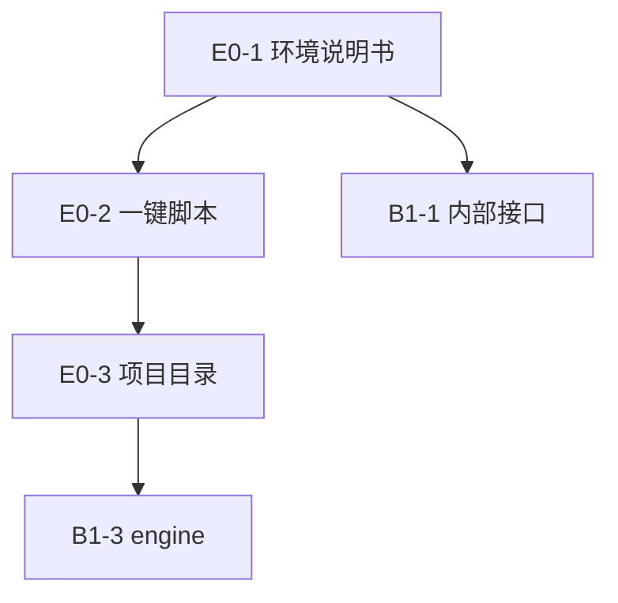

# 任务书 · 环境搭建与项目骨架（E0 线）

> **范围**：本仓库 `libdgc_paint` SDK 的**环境搭建**（说明书 + 一键脚本）与**基础项目目录建设**（CMake 骨架）。不包含消费者（Compose / GLFW / ImGui）的安装（输入平滑已下沉到 SDK 内核 `core/stroke_predictor`，无需消费者依赖）。
> **状态 SOT**：[`docs/tasks/任务线.md`](../任务线.md)（本文件不改状态列）。
> **依据**：[`DGCPaint_技术规划.md`](../../../DGCPaint_技术规划.md) §1、§2；[`docs/调研/路线整理.md`](../../调研/路线整理.md) §7。
> **版本**：v5.0 · 2026-08-21 · 环境线精简为 3 任务

---

## 范围 / 非范围

### 做

- **E0-1 环境搭建说明书**：Linux host + Windows(VS2026) 工具链、换机步骤、NDK/Vulkan 探测（纯文档）。
- **E0-2 一键脚本**：`setup-env.sh`，换机后快速搭建工具链（基于 E0-1 说明）。
- **E0-3 基础项目目录建设**：CMake 多 toolchain + 路线 option + `add_library(dgc_paint)` + 目录树 + presets + 空 kernels/render。

### 不做

- 不把 **GLFW / JDK / Android Studio GUI / Jetpack Compose / ImGui** 列为 SDK 必需。
- 不在本仓库创建 `ui/` `platform/` `app/` 或消费者工程。
- 不实现 L4/L5（真实内核/渲染），不宣称 §3.3 已测到达标。
- 不 `gh repo create` 消费者仓库（Git 拓扑归 **G0-1**）。

---

## 任务总表

| ID | 任务线 | 任务名称 | 依赖 |
|---|---|---|---|
| E0-1 | 线0-环境 | 环境搭建说明书（Linux/Windows 工具链、换机步骤、NDK/Vulkan 探测） | — |
| E0-2 | 线0-环境 | 一键脚本 `setup-env.sh`（换机后快速搭建） | E0-1 |
| E0-3 | 线0-环境 | 基础项目目录建设（CMake 多 toolchain + 目录树 + presets + 空 kernels/render） | E0-2 |

---

## 依赖关系

| 依赖 | 理由 |
|---|---|
| E0-2 → E0-1 | 一键脚本基于说明书列出的工具链版本下限。 |
| E0-3 → E0-2 | 建 CMake 工程需要工具链已就绪。 |
| B1-1 → E0-1 | Null 桩需要说明书确定的编译器版本。 |
| B1-3 → E0-3 | engine 是库内目标，依赖骨架已建。 |

---

## E0-1 · 环境搭建说明书

**目标**：换机后照文档即可搭好 SDK 编译环境。纯文档，不建工程。

**产出**

- `docs/env/env-setup.md`：Linux host（`build-essential cmake ninja-build libvulkan-dev`，cmake ≥ 3.22）+ Windows（VS2026「使用 C++ 的桌面开发」+「C++ CMake tools」+ LunarG Vulkan SDK）+ 换机步骤（clone → 探测 → 补缺）。
- 探测说明：NDK/Vulkan **有则探测、无则警告**（Null 后端不硬依赖）；cmake/ninja/C++ 编译器缺失则为硬错误。
- 明确不列 GLFW/JDK 为 SDK 必需。

**验收**

- 文档含 Linux + Windows 两套步骤与版本下限。
- 明确区分「硬依赖缺失（编译必败）」与「软依赖缺失（警告即可）」。
- 不新增工程 `CMakeLists.txt`。

**依赖理由**：无。

---

## E0-2 · 一键脚本

**目标**：`setup-env.sh` 一条命令换机搭环境，自动探测并提示补缺。

**产出**

- `scripts/setup-env.sh`：探测 cmake/ninja/C++ 编译器；缺则提示按 E0-1 说明书安装（Linux 可尝试自动 `apt install`，需 sudo 时声明）。
- NDK/Vulkan：有则打印版本，无则警告不失败。
- `--check` 模式：只探测不安装，输出缺项清单（对应 E0-1 的探测说明）。

**验收**

- 缺编译器时非零退出并给安装指引；仅缺 NDK/Vulkan 时 0 退出并警告。
- `--check` 输出缺项清单，与 E0-1 文档一致。
- 不创建 SDK CMake 工程。

**依赖理由**：E0-1。

---

## E0-3 · 基础项目目录建设

**目标**：一份 CMake 编 SDK 库，目录树立住。承接原 B1-2。

**产出**

- 顶层 `CMakeLists.txt`：`add_library(dgc_paint ...)`；路线 option `DGCPAIN_KERNEL_{BRUSH,MYPAINT,GPU}`、`DGCPAIN_RENDER_{VULKAN,SKIA,BGFX}` 与规划 §2.3 合法性检查一致。
- `CMakePresets.json`：`host-linux` / `host-windows` / `android-arm64`。
- 目录树：`core/` `sdk_api/` `kernels/` `render/` `tests/` `third_party/` 骨架；`kernels/` `render/` 可空占位，无实现时链 Null，**不得**填入真实 dab/compute。
- PUBLIC include **仅** `sdk_api/`（头文件可在 B1-4 才补齐；本任务至少把库目标与内部 sources 立住）。

**验收**

- `cmake --preset host-linux` 配置通过，编出 `libdgc_paint`（或静态库）。
- 不链接 GLFW/ImGui。
- `android-arm64` preset 文件存在；无 NDK 时失败信息可读。
- `host-windows` preset 文件存在；在 VS2026 上实测归后续 Windows 环境线（本任务只保证文件存在）。

**依赖理由**：E0-2。

---

## 评审打「通过」的必要条件

| 任务 | 指标 |
|---|---|
| E0-1 | 说明书含 Linux/Windows 步骤与版本下限；区分硬/软依赖 |
| E0-2 | `setup-env.sh` 缺编译器非零退出、缺 NDK/Vulkan 仅警告；`--check` 输出缺项 |
| E0-3 | `cmake --preset host-linux` 编出 dgc_paint；三 preset；不链 GLFW |

---

> **关联**：[`共同基座.md`](共同基座.md)。
