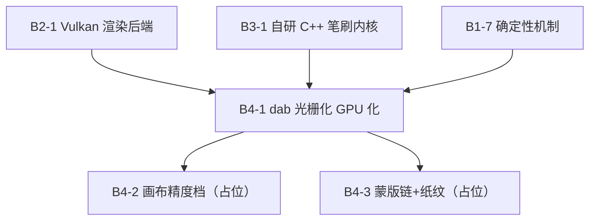

# 任务书 · 线4-画世界：复刻画世界渲染管线（dab 生成 GPU 化）

> **范围**：基于当前 E 线实现（自研 C++ 内核 `kernels/brush` + Vulkan compute `render/vulkan`），复刻画世界渲染管线，**把 dab 形状光栅化从 CPU 烘焙搬到 GPU compute**。本期实现 **B4-1**；画布精度档、图层蒙版链+纸纹两项在任务线**留占位**（B4-2/B4-3），本期不开工。
> **状态 SOT**：[`docs/tasks/任务线.md`](../任务线.md)。
> **依据**：[`docs/参考/画世界渲染管线解析.md`](../../参考/画世界渲染管线解析.md) §3.2（SDF+fwidth 覆盖）、§4.1（三档精度）、§4.3（compute 对照）、§5（蒙版链）、§6（纸纹）、§8（净室重写要点）；[`docs/调研/路线B-自研GPU内核-技术方案.md`](../../调研/路线B-自研GPU内核-技术方案.md) §2.1（compute 划分）、§3.a（dab_raster.comp）、§9（B0/B1/B3 阶段）。
> **版本**：v1.0 · 2026-08-25

---

## 范围 / 非范围

### 做（本期）

| ID | 内容 |
|---|---|
| B4-1 | GPU 端 dab 形状光栅化：compute shader 内 SDF + fwidth 抗锯齿覆盖，替代 CPU `MakeSoftCircleStamp` 每 dab 烘焙 + staging 上传。参数层仍留 CPU（路线 B 形态一）。加 CPU 参考 vs GPU 像素级对照测试。 |

### 留占位（本期不做，任务线已登记）

| ID | 内容 | 复刻画世界依据 |
|---|---|---|
| B4-2 | 画布精度档 16F/32F（当前固定 `rgba8`） | §4.1 `image2d_use16f` 三档 |
| B4-3 | 图层蒙版链（选区 `selMask` × 图层蒙版 `layerMask` × Alpha 锁定 `lockAlphaTex`）+ 纸纹背景 | §5 / §6 |

### 明确不做（本期乃至后续线的边界）

- **参数层 GPU 化**（`dab_generate.comp`，路线 B 形态二）：把间距/压力曲线/抖动/HSV 随机也搬进 GPU。B4-1 只搬「形状 → 覆盖」这一段，参数层仍 CPU（理由见路线 B §2.1/§9：手感调参需热加载，冻结前不进 GPU）。
- **椭圆/方形/空心完整形状集**：B4-1 只保证圆形软笔 1:1 迁移 + 预留 `shapeType` 扩展位；扩展形状后续任务。
- **多图层**：仍单画布 storage image。
- **窗口/swapchain 上屏**：仍离屏（B2-1 既有取舍）。

---

## 任务总表

| ID | 任务线 | 任务名称 | 依赖 |
|---|---|---|---|
| B4-1 | 线4-画世界 | dab 形状光栅化 GPU 化：compute 内 SDF+fwidth 覆盖替代 CPU stamp 烘焙 + CPU/GPU 像素对照 | B2-1、B3-1、B1-7 |
| B4-2 | 线4-画世界 | 画布精度档 16F/32F（复刻画世界 §4.1）（占位：本期不做） | B4-1 |
| B4-3 | 线4-画世界 | 图层蒙版链（选区/图层蒙版/Alpha锁定）+ 纸纹（复刻画世界 §5/§6）（占位：本期不做） | B4-1 |

## 依赖关系

| 依赖 | 理由 |
|---|---|
| B4-1 → B2-1 | 改 `render/vulkan/brush_composite.comp` 与 `vk_backend.cpp`（去掉 per-dab 纹理上传）。 |
| B4-1 → B3-1 | `StampData` 参数语义（pos/radius/hardness/softness/opacity/rgb）是 GPU 光栅化输入。 |
| B4-1 → B1-7 | 确定性回归（B5-3）是「GPU 化不改变笔迹」的底座。 |
| B4-2/B4-3 → B4-1 | 登记顺序约束：先做 dab GPU 化，再做精度档/蒙版链。占位任务启动需人工确认。 |

---

## B4-1 · dab 形状光栅化 GPU 化

**目标**：把 dab 形状光栅化从 CPU（`MakeSoftCircleStamp` 逐 dab 烘焙像素 + staging 上传成 stamp 纹理）搬到 GPU compute shader，复刻画世界 §3.2 的「SDF 覆盖 + fwidth 抗锯齿」算法骨架。参数层（间距/压力曲线/抖动/HSV 颜色调制）仍留 CPU（路线 B 形态一），只搬「形状 → 覆盖」这一段。

**产出**

1. `render/vulkan/brush_composite.comp` 演进为「内联形状光栅化 + over 合成」融合版（路线 B §9 B1 推荐形态）：
   - push_constant 从「stampPos/stampSize/opacity/alphaLock」扩为携带 dab 参数：`pos`、`radius`、`hardness`、`softness`、`opacity`、`rgb`、`shapeType`（预留扩展位）。
   - shader 内对画布像素做**圆形 SDF 覆盖**：`distToCenter = distance(pixelCoord, pos)`，`ww = fwidth(distToCenter)`，`smoothstep(-ww, ww, ...)` 抗锯齿，再叠加 hardness/softness 软硬边（对齐画世界 §3.2 圆形公式与 B3-1 `MakeSoftCircleStamp` 的 hardness→edge→smoothstep 语义）。
   - 不再上传 stamp 纹理：移除 per-dab `CreateStampTexture` + `vkCmdCopyBufferToImage` 上传路径（staging buffer 可仅保留给清屏/其它用途或移除）。
   - `shapeType` 位预留（0=圆形软笔；1=方形 / 2=椭圆 / 3=空心 为扩展位，本期不实现）。

2. CPU 参考保留：`MakeSoftCircleStamp` 保留为参考实现（或挪进测试侧），供对照。

3. 确定性对照测试（新增 ctest）：同一组 `StampData`，CPU 参考光栅化 vs GPU 光栅化结果做像素级 diff（容差按审核定，建议 ≤ 8/255，SDF 抗锯齿允许软边缘微差）。双证：① 对照 diff；② B5-3 同 seed 两次 PNG 像素一致回归保持绿。

**验收**

- 相同 `StampData` 序列，GPU 光栅化结果与 CPU 参考像素 diff 在容差内（ctest 断言）。
- 渲染路径无 per-dab CPU 烘焙 + staging 纹理上传（代码级确认路径移除，或仅测试引用）。
- `shapeType` 在 push_constant 与 shader 中预留，默认圆形。
- host `ctest` 全绿（含 B5-3 确定性回归）；`android-arm64` preset 在 NDK 满足时仍编出 `.so`（无 NDK 时 host 通过即可）。
- 笔迹观感与 B2-1/B3-1 现状一致（diff + 确定性回归双证），不复现「U2 已记录的 dgcClear 恒清白」类回归。

**依赖理由**：见依赖关系表。

---

## B4-2 · 画布精度档 16F/32F（占位）

**目标**：画布缓冲精度从固定 `VK_FORMAT_R8G8B8A8_UNORM` 扩展为 16F/32F 三档（复刻画世界 §4.1 `image2d_use16f`：0=直接写 FBO / 1=16F / 2=32F）。本期**仅登记占位，不开工**。
**启动前提**：B4-1 完成后，经人工确认再细化任务书与验收（DGCamp 侧对应 §4.0.5 离屏模式，16F 是画质/带宽平衡点）。
**验收（预留）**：三档精度可配置；确定性回归保持绿；性能/带宽数据对比。

---

## B4-3 · 图层蒙版链 + 纸纹（占位）

**目标**：图层级合成蒙版链——选区 `selMask` × 图层蒙版 `layerMask` × Alpha 锁定 `lockAlphaTex` + 取反 + 色彩空间转换（复刻画世界 §5），以及纸纹背景层（§6，`u_texture_paper`/`paper_scale`/`shadow_percent`）。本期**仅登记占位，不开工**。
**启动前提**：B4-1 完成后，经人工确认再细化任务书与验收（与需求文档的 Alpha 锁定/图层蒙版/剪辑蒙版/选区直接对应；纸纹默认无、可切换）。
**验收（预留）**：蒙版链 uniform/位到位；Alpha 锁定 / 图层蒙版 / 选区行为可断言；纸纹可开关。

---

## 评审打「通过」的必要条件

| 任务 | 指标 |
|---|---|
| B4-1 | compute 内 SDF+fwidth 覆盖；无 per-dab 烘焙+上传；CPU/GPU 像素 diff 对照测试；`shapeType` 预留；host ctest 全绿 + B5-3 回归绿 |
| B4-2 | 仅任务线登记占位，本期不验收 |
| B4-3 | 仅任务线登记占位，本期不验收 |

---

## 里程碑

| 里程碑 | 触发 | 交付 |
|---|---|---|
| 画世界-M1 | B4-1 | dab 光栅化全 GPU，stamp 烘焙/上传消除，CPU/GPU 像素一致有断言 |
| 画世界-M2 | B4-2（占位，后续） | 画布 16F/32F 三档精度 |
| 画世界-M3 | B4-3（占位，后续） | 蒙版链 + 纸纹 |

---

> **后续不在本任务书范围**：参数层 GPU 化（形态二）、椭圆/方形/空心形状集、多图层、窗口上屏；A/C/D 专线。
